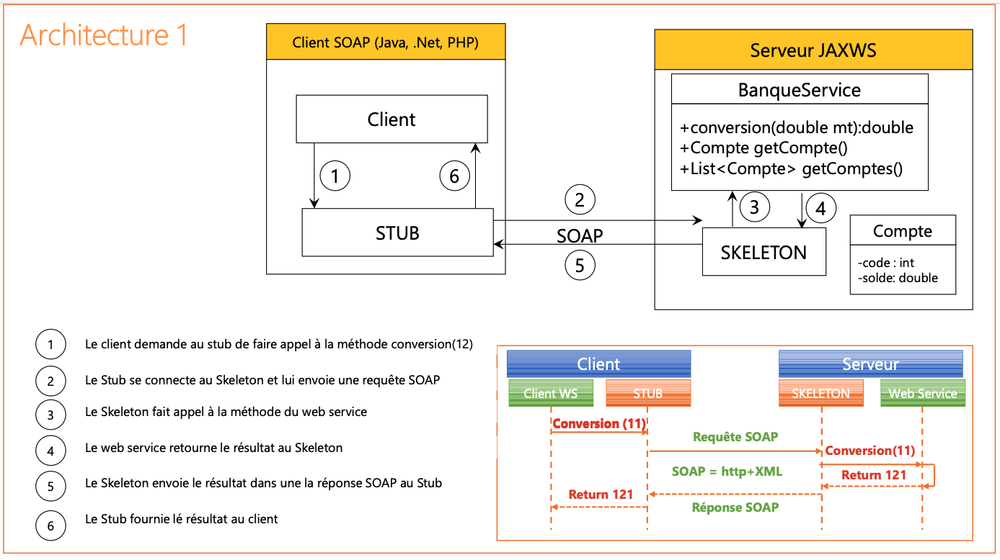

# Web service SOAP Banque avec un simple Serveur JaxWS et WSDL

### 1. Créer un Web service qui permet de :

- Convertir un montant de l’auro en DH 
- Consulter un Compte 
- Consulter une Liste de comptes

### 2. Déployer le Web service avec un simple Serveur JaxWS

### 3. Consulter et analyser le WSDL avec un Browser HTTP

### 4. Tester les opérations du web service avec un outil comme SoapUI

##### Convertir un montant de l’auro en DH

##### Consulter un Compte

##### Consulter une Liste de comptes

### 5. Créer un Client SOAP Java

### Architecture

